<div align="center">


# Benchly

**Put any PC on the bench.**

The single window I reach for when a Windows machine lands on my bench —
the tool that finally retired the USB stick full of half-trusted freeware
I'd been lugging around since 2014.

<br>

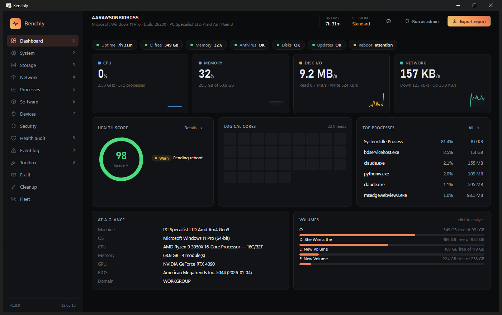

</div>

---

It's one portable `.exe`. No installer to babysit, no account to make, nothing quietly
phoning home. Double-click it and — about a second later — you're looking at the whole
machine: live vitals, the deep hardware inventory, disk health, the network, what's set
to autostart, what's quietly listening for connections, what's broken, and how to put it
right. All in a UI that, mercifully, doesn't look like it escaped from 2009.

Here's the part I care about most. Lots of tools bundle a pile of utilities. What makes
Benchly different is that **every action that touches Windows tells you exactly what it's
about to change, and where** — and **anything that leaves the machine gets named out
loud**. So you can plug it into a client's PC and actually know what it did. No guessing.

## Grab it and go

Head to the [**Releases**](../../releases/latest) page and take your pick:

| If you want… | Grab | What you get |
|---|---|---|
| **The no-fuss option** | `Benchly-x.y.z-portable.exe` | One file. Run it off the desktop, a share, or a USB stick — nothing gets installed. |
| **A tidy install** | `Benchly-Setup-x.y.z.exe` | Start-menu entry, an optional desktop shortcut, and a clean uninstaller. |

Double-click and you're in. A handful of checks — SMART drive wear, BitLocker, TPM,
Secure Boot, the system-wide tweaks — need admin rights. When one does, just hit **Run as
admin** in the title bar; Benchly relaunches elevated and drops you right back where you
were.

> Runs on **Windows 10 or 11**, 64-bit. It rides on the WebView2 runtime, which is already
> on every Windows 11 and current Windows 10. On a stripped-down LTSC image that's missing
> it, Benchly will point you at the quick one-time download.

## A quick wander through it

Everything lives on the pages down the left. Tap a number key to jump to one, or hit
**Ctrl + K** for a command palette that searches every page and action by name.

**Get the lay of the land.** The **Dashboard** is your first ten-second glance — CPU, RAM,
disk and network graphs that genuinely tick once a second, a per-core grid, a health-score
ring, and whatever's hogging the machine right now. **System** is the full inventory, down
to each RAM stick's part number — and, for the overclockers, GPU clocks with the live
throttle reason and a history of driver resets. **Storage** reads honest SMART health,
temperature and wear, *forecasts* which drive is heading for failure, then lets you dig into
where the space actually went. **Processes** is a live, sortable table with end-task on hover.

**Poke at the network — and the web.** On top of the usual ping / traceroute / DNS / port
tools, Benchly can **look up any domain** (how old it is, its certificate, who hosts it,
its reputation — so you can size up a site before trusting it), **unmask a shortened link**
by quietly following every redirect without opening it, and **scan the Wi-Fi** around you
for signal and channel congestion.

**Decide what you can trust.** **Security** shows your real antivirus (it reads Security
Center, so a third-party AV isn't mistaken for "nothing's protecting this PC"), maps the
whole **autostart** surface, hunts the quieter **persistence** spots (WMI subscriptions,
services running encoded PowerShell, Defender exclusions), scores the machine against a
**hardening checklist** with one-click reversible fixes, audits the **trusted root
certificates** for the kind of roots that quietly intercept your HTTPS, lists every
**listening port** with the signed-or-not process behind it, and even reads **raw email
headers** to sniff out phishing — all backed by a VirusTotal check that only ever sends a
hash, never your file.

**Fix it and tidy it.** The **Toolbox** streams the heavy repair tools (SFC, DISM, chkdsk,
winsock, Windows Update reset) live, snapshots a **baseline** so you can diff "before" and
"after," grabs a 30-second **"why is it slow right now?"** snapshot, and adds a **power, sleep
& wake doctor** and a set of **gremlin hunters** for the intermittent stuff (what woke it at
3 AM, what's secretly hammering the disk, the freeze you can mark the instant it happens).
**Fix-It** walks you through guided runbooks for the everyday complaints. **Cleanup** clears
junk, hunts down big and duplicate files, debloats the preinstalled cruft, repairs the
cosmetic Windows breakages (blank icons, dead Store, broken Start search), and gives you a
shelf of documented, reversible **Windows tweaks**. **Software** will even update your
installed apps through winget.

**Look after the not-so-technical.** The **Helper** page is for when you're the family's IT
person: big friendly buttons that text you a plain-English health summary, calm a noisy PC
down (ads, widgets, Start suggestions — all in one click), reset the text size when it's
suddenly huge, fix the camera or mic that only fails in one app, surface the **BitLocker
recovery key** so it's saved before a repair ever asks for it, and **copy** a relative's
photos and documents safely off a dying drive without ever writing to it.

**Sort out the update, the boot and the disk.** When a machine won't behave, the **Toolbox**
now answers the everyday "why": a **pending-restart** check (the breadcrumbs Windows leaves
when it's waiting on a reboot — and why your updates keep failing), an **update doctor** that
translates the cryptic `0x800f…` Windows Update errors into plain English, and a
**component-store cleanup** for "where did the space on C: go?". **Event Log → Boot time**
shows what's actually dragging out your boot.

**Look after the work machines too.** The **Workplace** page is for the corporate and
small-business PCs an IT pro manages: is Windows **activated** and on what licence, is it
**Entra / domain joined or just a workgroup**, which **Group Policies** are applied, and is
the **clock** drifting (the silent cause of sign-in and certificate errors). Its **managed
baseline** even lets you set the policies an admin usually pushes via GPO or Intune — Windows
Update deferrals, a BitLocker startup PIN, telemetry, auto-lock — on a standalone PC, each one
reversible and showing the exact registry key.

**Hand it off, or scale it up.** One click spits out a clean, client-ready **HTML + PDF
report** (built in the background, with a JSON twin for your own use). **Fleet** lines those
reports up across machines and pulls remote snapshots over WinRM.

Want the nitty-gritty, page by page? It's all in **[docs/features.md](docs/features.md)**.

<table>
<tr>
<td width="50%">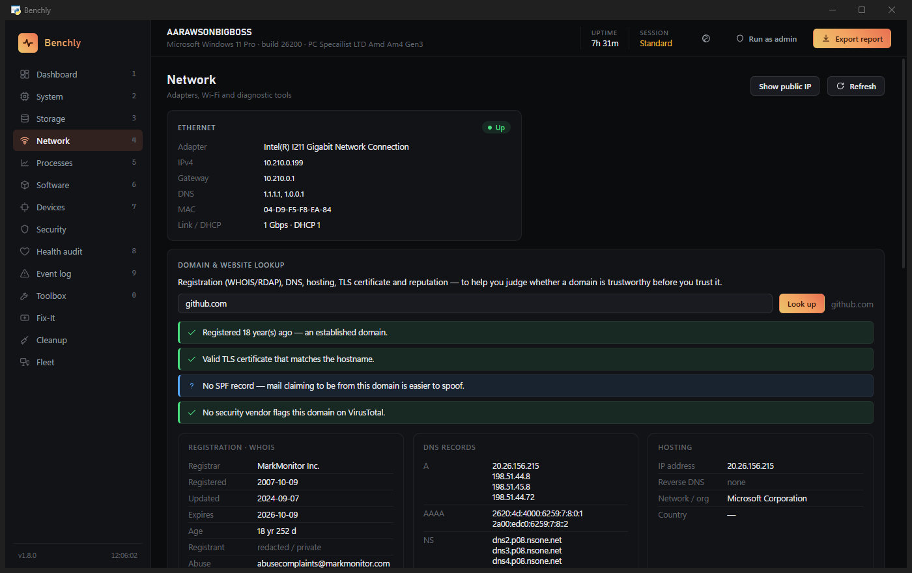<br><sub><b>Domain & website lookup</b> — a plain-English read on whether a site's worth trusting.</sub></td>
<td width="50%">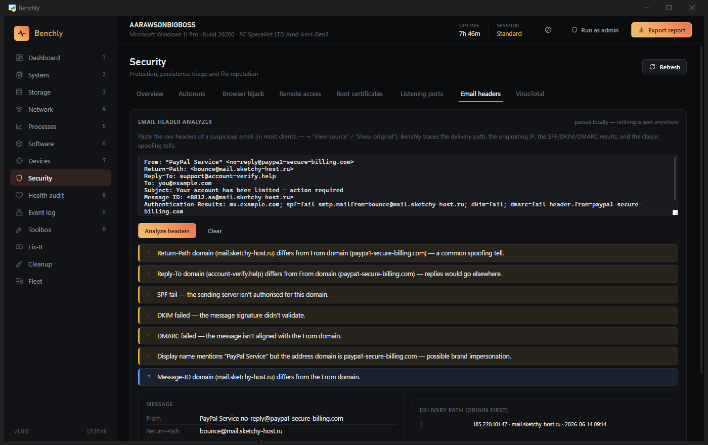<br><sub><b>Email header analyzer</b> — paste raw headers and watch every spoofing tell light up. All local.</sub></td>
</tr>
<tr>
<td width="50%">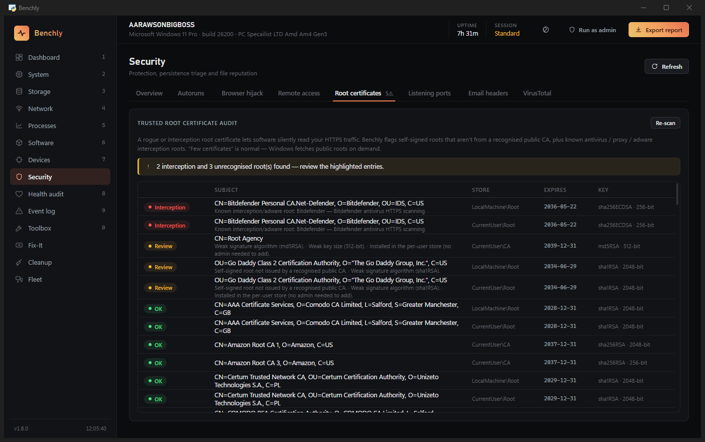<br><sub><b>Root certificate audit</b> — the roots that quietly intercept HTTPS, surfaced and explained.</sub></td>
<td width="50%">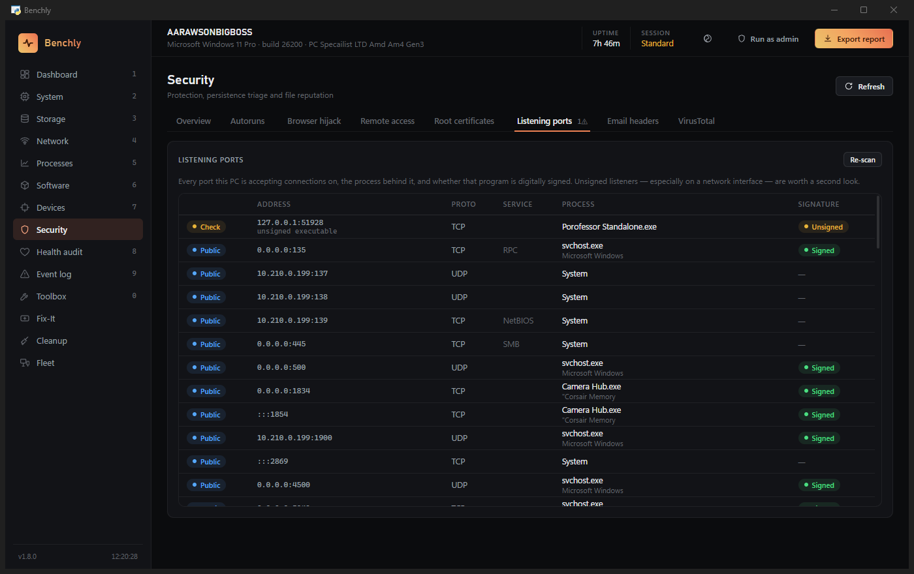<br><sub><b>Listening ports</b> — every open port, the process behind it, and whether it's signed.</sub></td>
</tr>
<tr>
<td width="50%">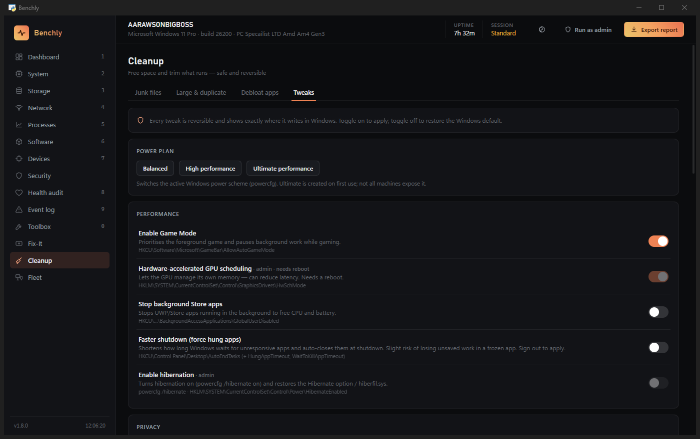<br><sub><b>Tweaks</b> — every one reversible, and each shows the exact registry key it writes.</sub></td>
<td width="50%">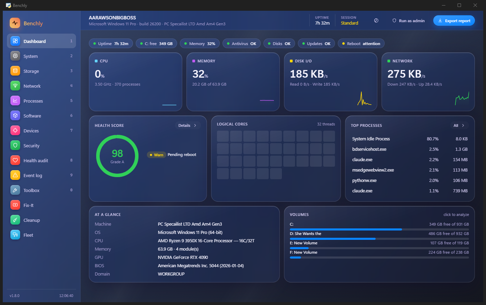<br><sub><b>Frosted Glass theme</b> — the same app, in glass. Flip it on live from the title bar.</sub></td>
</tr>
</table>

<details>
<summary><b>A few more screenshots</b> — system, storage, health, events, processes, app updates, toolbox</summary>

<table>
<tr>
<td width="50%">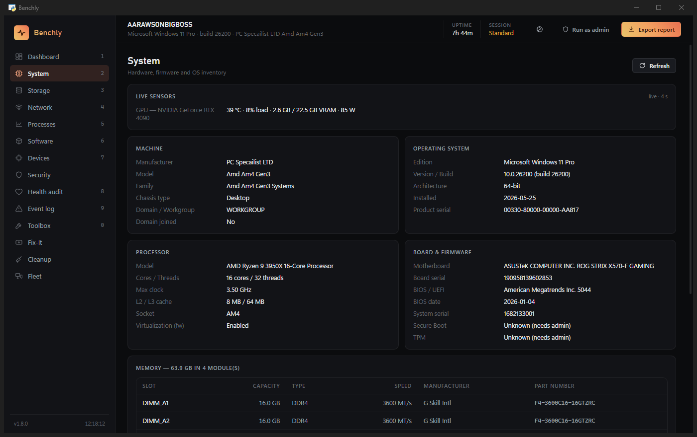<br><sub><b>System</b> — the deep inventory, right down to each RAM module's part number.</sub></td>
<td width="50%">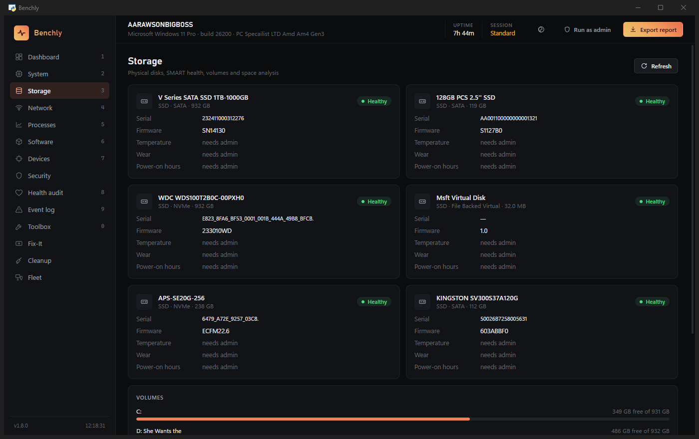<br><sub><b>Storage</b> — real SMART health, temperature and wear, plus a space analyzer.</sub></td>
</tr>
<tr>
<td width="50%">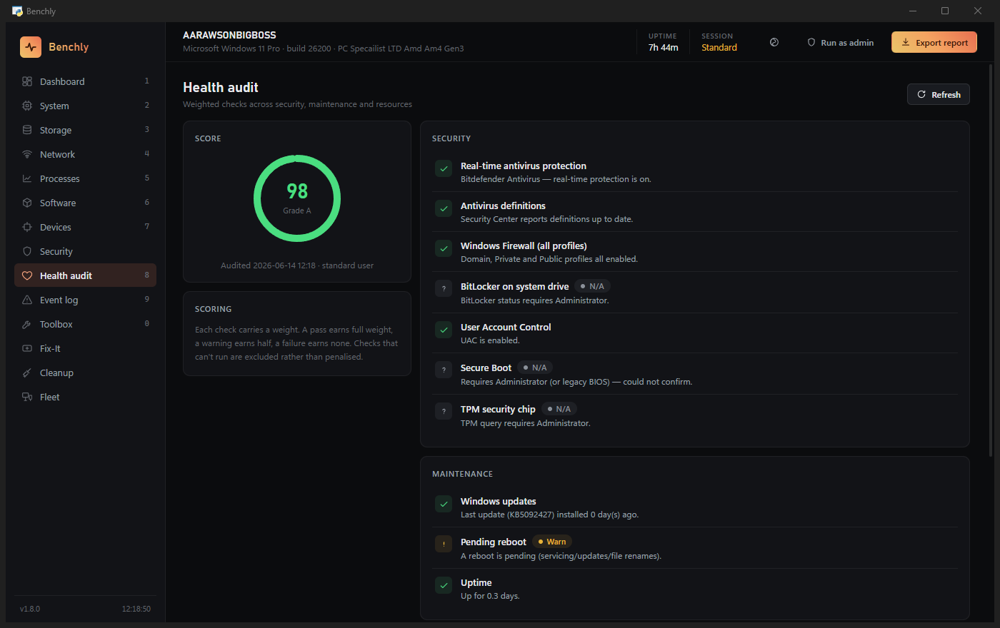<br><sub><b>Health audit</b> — 14 weighted checks rolled into a score, each failure with a one-click fix.</sub></td>
<td width="50%">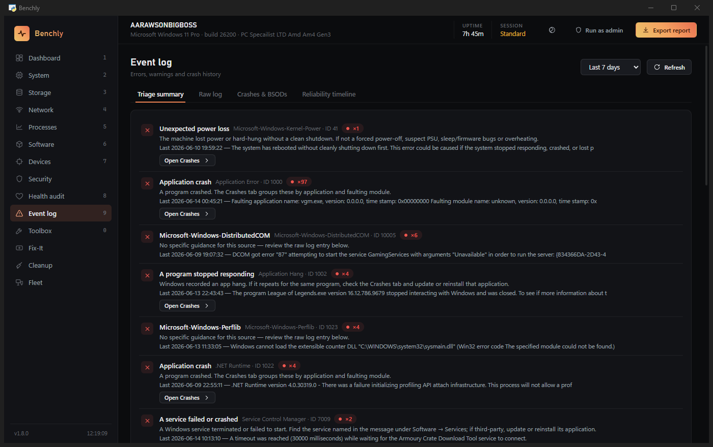<br><sub><b>Event log</b> — events grouped and explained in plain English, not raw Event IDs.</sub></td>
</tr>
<tr>
<td width="50%">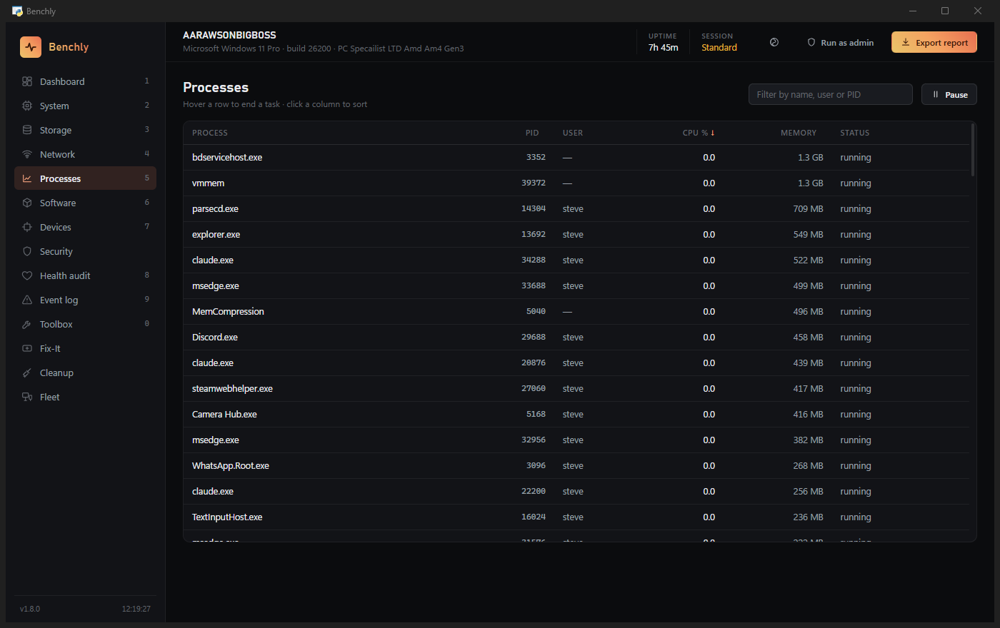<br><sub><b>Processes</b> — a live, sortable table; click a row for a Process-Explorer-style drawer.</sub></td>
<td width="50%">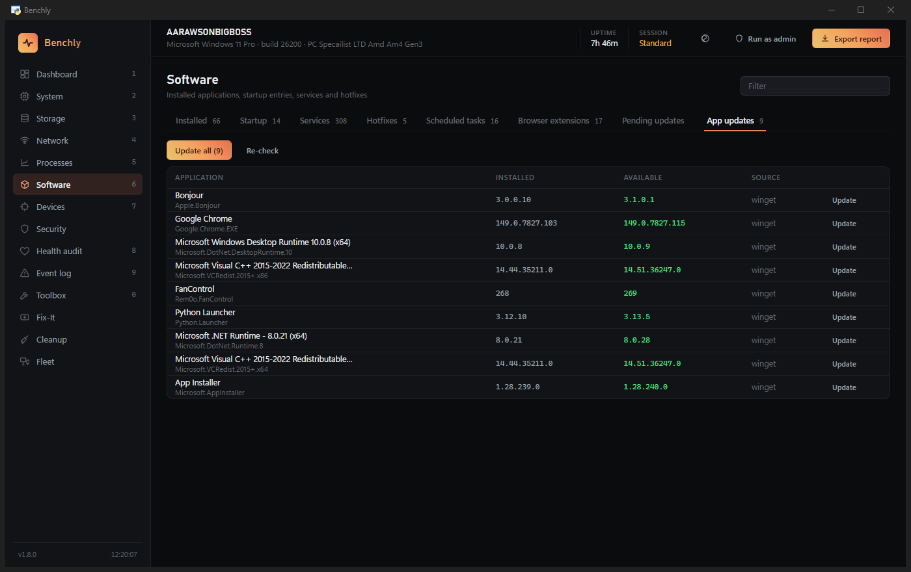<br><sub><b>App updates</b> — newer versions of your installed apps, updated through winget.</sub></td>
</tr>
<tr>
<td width="50%">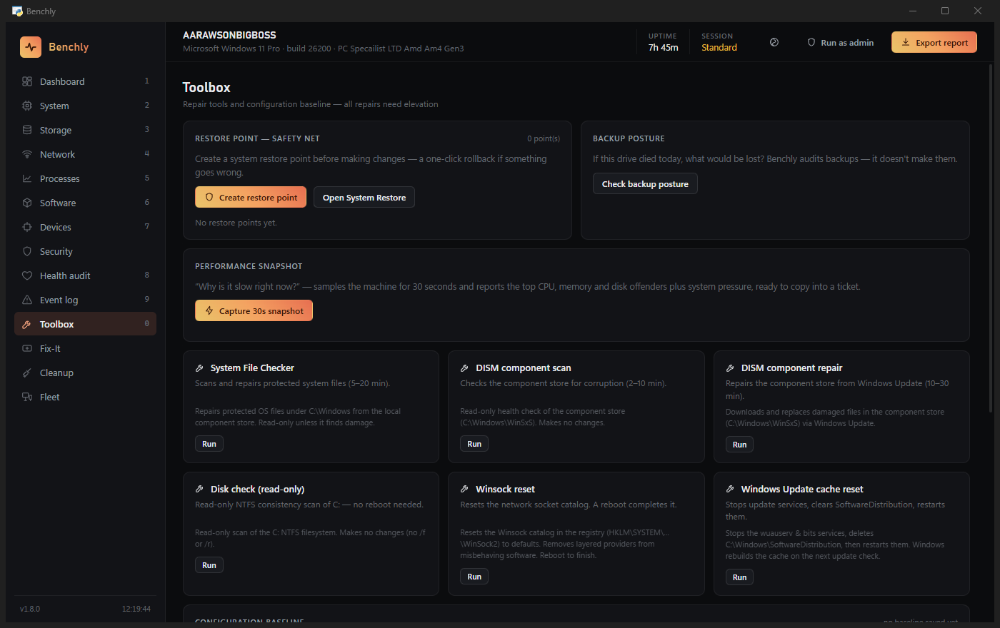<br><sub><b>Toolbox</b> — streamed repair tools, a config baseline, and that perf snapshot.</sub></td>
<td width="50%"></td>
</tr>
</table>

</details>

## The bit other tools skip: telling you what they did

Benchly is built for the awkward reality that you're often working on *someone else's*
machine. That only works if you can trust it — so two promises run right through it:

- **Every change is spelled out, right there.** A repair tool tells you the exact paths and
  services it's about to touch. A tweak shows you the precise registry key it writes. A
  destructive action lists the files it'll remove *before* you hit confirm.
- **Nothing slips out quietly.** A VirusTotal check sends a **hash, never the file**. A
  domain lookup sends the **domain name** to public registries and shakes hands with the
  host over TLS — nothing about your browsing. Remote snapshots use credentials you type,
  passed through the environment once and **never written to disk**. The email and URL tools
  read and resolve; they never run anything.

If you want the honest, line-by-line version, it's in
**[docs/privacy-and-safety.md](docs/privacy-and-safety.md)** — worth a skim before you press
anything destructive.

## Handy to know

| Key | What it does |
|---|---|
| **Ctrl + K** | The command palette — every page and action, fuzzy-searchable |
| **1 – 9** | Jump straight to a page; **0** lands on the Toolbox |
| **/** | Focus the current page's filter · **Esc** clears it |
| `--page <name>` | Boot straight onto a page |
| `--theme frost` | Boot in the Frosted Glass theme |

Anything you'd otherwise be retyping — serials, MACs, IPs, hashes — is click-to-copy.
There are two looks: **Graphite** (the flat dark default) and **Frosted Glass** (glass with
a gradient you can tweak), and you can flip between them live from the title bar. Click the
version number whenever you're curious what's new.

**It updates itself.** Click the version number (or Ctrl + K → "Check for Benchly updates")
and, when there's a newer build, Benchly downloads it, checks it against the release's
published SHA-256, swaps itself in place and relaunches — with an on-theme progress bar the
whole way. Portable or installed, it's the same one click; an install under `Program Files`
just adds a single UAC prompt.

## Building it yourself

```powershell
python -m venv .venv
.venv\Scripts\pip install pywebview psutil pyinstaller pillow
.venv\Scripts\python app.py            # run it straight from source

.\build_portable.ps1                   # → dist\Benchly.exe
& "$env:LOCALAPPDATA\Programs\Inno Setup 6\ISCC.exe" installer.iss   # → dist_installer\
```

The whole build-and-release routine — bumping the version, tagging, cutting a GitHub
release — lives in **[docs/building.md](docs/building.md)**.

## Under the hood

- **The shell** is a [pywebview](https://pywebview.flowrl.com/) window on Windows' WebView2
  runtime — a native window with a web front-end, no browser bundled along.
- **The backend** (`backend/`) is Python: `psutil` for the snappy one-second telemetry,
  batched PowerShell / CIM queries for the deep inventory (one round-trip per area, JSON
  back over stdout), and straight registry reads for software and startup. Long jobs stream
  to the UI through a little background-job store, and everything degrades gracefully when
  it can't get admin rights instead of throwing an error in your face.
- **The frontend** (`ui/`) is hand-written HTML, CSS and JavaScript. No framework, no CDN,
  no build step — it runs fully offline. Canvas sparklines, a strict content-security-policy,
  and a dark theme that's easy on the eyes for a long session at the bench.

It's a solo project, so the code's closed-source and the releases are really for my own
bench — but the notes above are the honest shape of how it's put together.

## Got questions?

The usual ones — *is it safe on a client's PC?*, *why does it want admin?*, *does it work
offline?*, *where does my data live?* — are answered like a human in
**[docs/faq.md](docs/faq.md)**. And every release is logged in
**[CHANGELOG.md](CHANGELOG.md)**.
